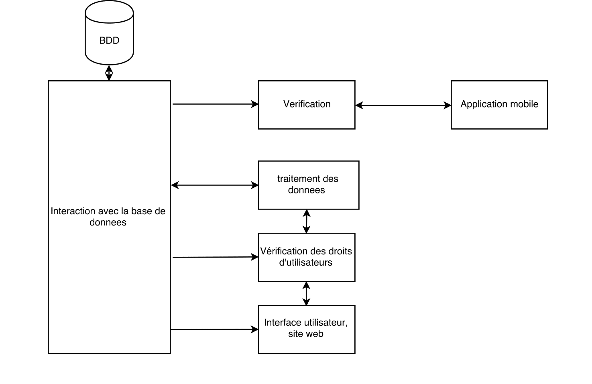
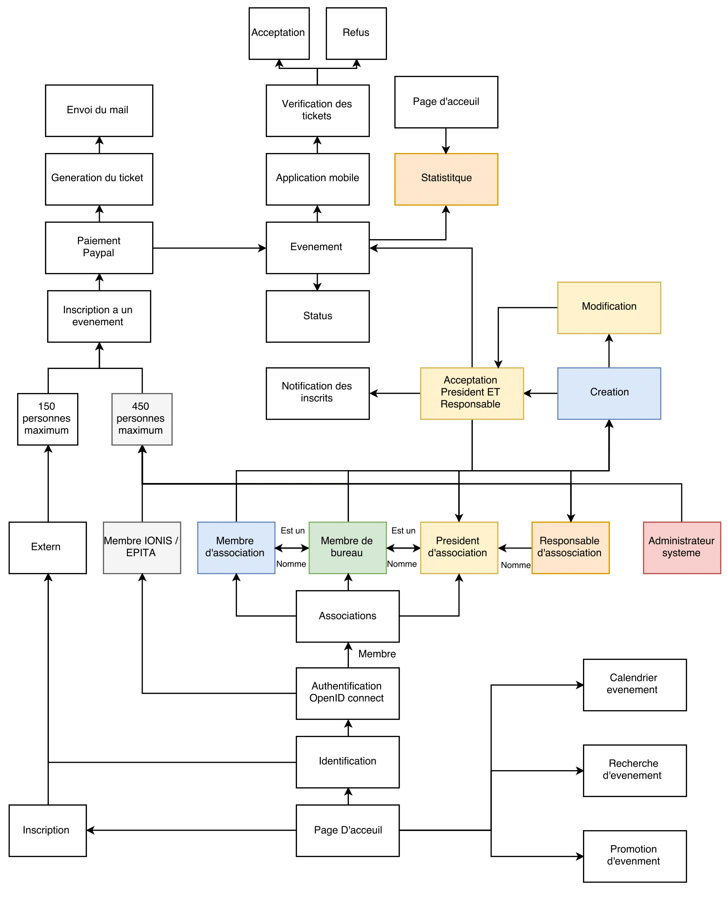
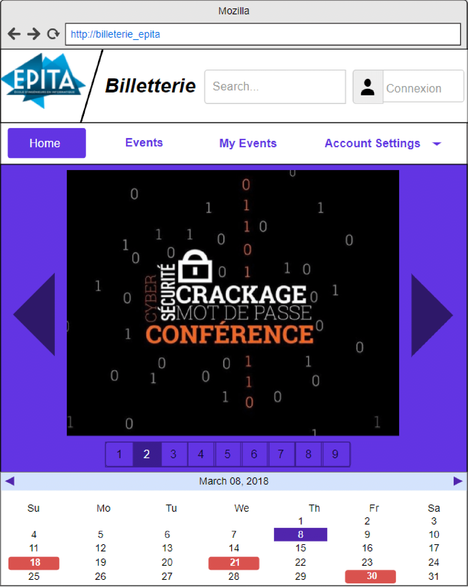

# Le projet Tickets

## Situation des associations de l'EPITA

### Les évenements des associations

  L'EPITA est une école d'ingénieurs en informatique basée à Paris, mais aussi à
  Lyon, Rennes, Strasbourg et Toulouse où sont situés des campus de cycle
  préparatoire intégré.

  La vie associative de l’école est riche, et les associations qui organisent évènements ont besoin de nouveaux outils pour les aider à gérer les
  inscriptions ainsi que la vérification des billets des participants aux
  évènements.

  Les associations organisent plus de trois évènements par semaine, rassemblant
  en moyenne 80 étudiants. Cependant, certains évènements rassemblent parfois
  plus de 500 participants.

### Cycle de vie d’un évènement

1.  Inscription à l’évènement
    * Réservations manuscrites
    * Réservations en ligne
    * Pas de réservations
2.  Vérification aux entrées
    * Vérification manuelle en comparant avec la liste papier

### Organisation

Actuellement, les associations inscrivent les participants à la main ou en ligne
pour les plus grandes d’entre elles.

Elles transmettent ensuite la liste papier aux personnes responsables de la
gestion des entrées et sorties des évènements.

Elles doivent ensuite comparer les noms des arrivants avec la liste papier, puis
leur tamponner un symbole sur la main pour les reconnaître plus rapidement lors
de leurs sorties et entrées au cours de l’évènement.

### Stratégie

1.  Inscription à l’évènement
    * Billeterie EPITA (sur place)
    * Réservations en ligne
2.  Vérification aux entrées
    * Vérification automatique (achat sur place)
    * Vérification automatique des billets

Les associations souhaitant utiliser leur propre billetterie pourront tout de
même utiliser la plateforme pour gérer leurs évènements.

### Maturité des utilisateurs

Les membres des associations sont essentiellement des élèves de l’école, et sont
donc déjà familiers à ce genre de technologie de réservation et gestion en
ligne.
Il faudra tout de même veiller à rendre l’interface la plus simple et claire
possible.

Concernant les personnes aux entrées des évènements, beaucoup utilisent
certainement déjà ce genre de processus de vérification. En effet, la plupart
des billets sont vérifiés de cette manière de nos jours.

Enfin, ce nouveau système permettra à toutes les associations -- quels que
soient leurs moyens ou leur taille -- de proposer des évènements.

Ce nouveau système de billetterie devrait donc être plutôt bien accueilli, voire
attendu.

## Analyse des besoins

### Problématique du client

Les associations d’EPITA souhaiteraient une homogénéisation de la gestion des
évènements. Aujourd’hui, l’organisation est trop disparate.

Certaines associations ont un système de billetterie en ligne externe, d’autres
inscrivent les participants à la main, mais dans tous les cas la vérification
des inscriptions se fait toujours manuellement.

Il faudra donc absolument permettre à tous d’automatiser en ligne la gestion des
inscriptions, et surtout d’effectuer plus efficacement les entrées et sorties
aux évènements.

### Fonctionnalités du projet

* Vitrine d’évènements organisés par les associations d’EPITA
  > L’utilisateur doit pouvoir retrouver facilement tous les évènements

* Gestion simplifiée des évènements
  > statut de l’évènement, le nombre d’inscrits, etc.

* Regroupement de l’information
  > Le site s’adapte en fonction du statut de l’utilisateur (étudiant,
  organisateur, président d’association, externe, etc.)

* Rendre accessible la gestion d’évènements aux plus petites associations

* Création d’un billet à usage unique

* Envoi de courriel résumant les informations relatives à l’évènement

* Données des utilisateurs sécurisées
  > Paiement, informations personnelles

* Importation et exportation de fichiers XLS
  * Les listes des participants seront gérées au format XLS (Excel)

## Les technologies utilisées
### Front-End
La partie front-end du projet utilisera 2 technologies qui sont le duo HTML/CSS
et Bootstrap

* **HTML5/CSS3**
Comme tout site web, le projet utilisera le duo HTML/CSS pour respectivement le
fond et la mise en forme du site.

Nous utiliserons tout particulièrement la dernière révision de HTML qui est la 5
permettant entre autres points l’intégration plus facile de code dynamique, une
amélioration sémantique ainsi que notamment une prise en charge plus évoluée de
la navigation sur site mobile (diminution notable des risques de crash et
augmentation de la fluidité de navigation.

Le CSS3 sera utilisé pour toute la partie graphique et mise en page de façon
étroitement liée à Bootstrap.

* **Bootstrap**
Bootstrap est un framework CSS aidant à une mise en place de la partie front-end
beaucoup plus rapide, avec une adaptabilité multi-plate-forme déjà incluse.

L’ensemble des possibilités incluses permettra notamment un gain de temps
considérable pour un résultat bien au-dessus d’une création « from scratch ».

### Back-End

#### $\Rightarrow$ Python with Django
Notre projet utilisera la technologie la plus utilisée aujourd’hui pour les
applications web, Django.

L’utilisation du framework Django a de nombreux avantages :

* utilisation d’un langage de programmation robuste et versatile (contrairement
  au PHP uniquement réservé au web) avec python dont les preuves ne sont plus à
  faire.

* Facilité d’apprentissage

* Rapide à écrire

* Forte lisibilité

* Grande capacité d’adaptation

* Nombreuse aide aux développeurs pour augmenter la sécurité

* Possède une très grande base d’aides et de modules pour des utilisations
  diverses et variées.

Toutes ces raisons nous poussent vers Django, avec toujours en tête une idée
d’efficacité et de perfectionnisme dans le produit.

## Architecture globale du projet

## Fonctionnement de la solution

## Design previsionnel du site web

